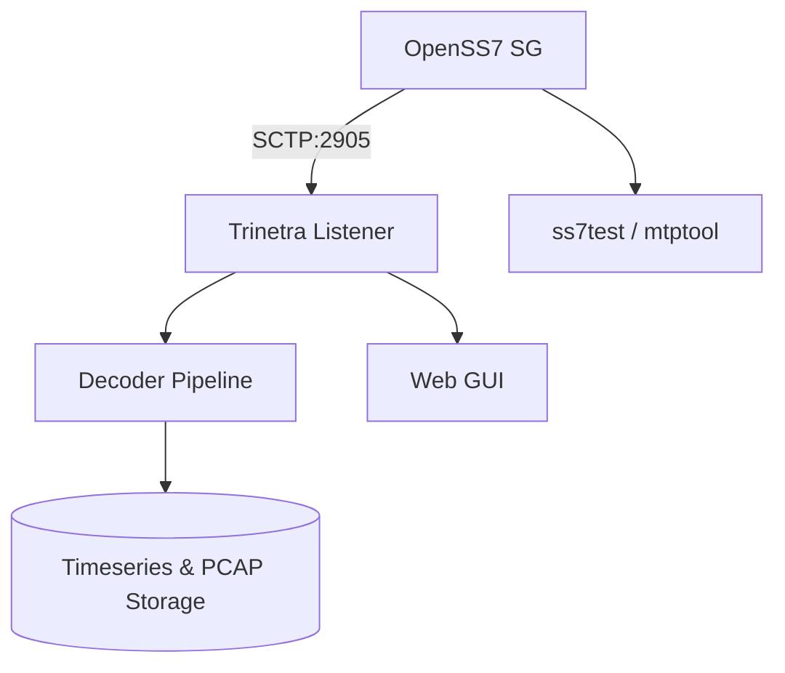
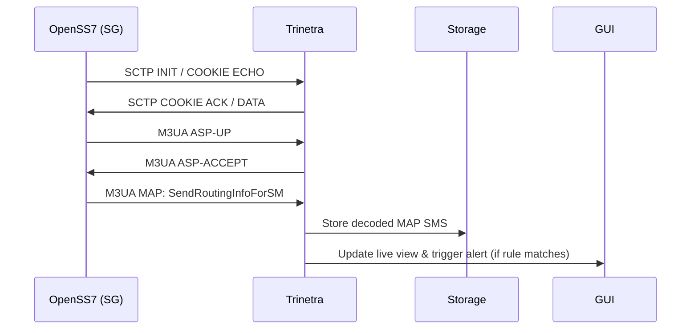

# SS7/SIGTRAN Bridge with Trinetra Integration

*A complete, enterprise‑grade README with configuration, testing, security, scaling and diagrams (Mermaid & ASCII) — ready for GitHub.*

---

**Note:** This document contains multiple Mermaid diagrams which render on GitHub and many Markdown viewers. For PNG exports, see the **"Exporting diagrams"** section near the end.

---

## Table of Contents

1. Introduction
2. Background: SS7, SIGTRAN & Trinetra
3. System Requirements
4. Quick Install (commands)
5. Full Installation (step-by-step)
6. Configuration — deep dive (OpenSS7, sigtran, Trinetra)
7. Testing & Validation (tools, scenarios, pcap analysis)
8. Scaling & Deployment Options (VMs, containers, multi-node)
9. Security, Compliance & Logging
10. Troubleshooting & Common Errors
11. Maintenance & Upgrades
12. File & Repo Structure
13. Diagrams

    * Architecture Diagram (Mermaid)
    * Component Breakdown (Mermaid)
    * Sequence Diagram: SS7 Message Flow (Mermaid)
    * Deployment Topology (ASCII + Mermaid)
14. Exporting diagrams to PNG/SVG
15. References
16. Legal Disclaimer

---

## 1. Introduction

This repository documents how to build a **single-node SS7/SIGTRAN bridge** using **OpenSS7** on commodity hardware (Ryzen3 laptop recommended minimum) and integrate it with **Trinetra** for multi‑protocol analysis. The guide is meant for **lab/authorized testing** and *not* for connecting to live telco networks without permission.

---

## 2. Background: SS7, SIGTRAN & Trinetra

* **SS7**: Legacy telephony signaling stack (MTP1-3, SCCP, ISUP, MAP etc.) used for call control, SMS, roaming and more.
* **SIGTRAN**: Suite of protocols (M3UA, SUA, M2PA) to carry SS7 over IP using **SCTP**.
* **Trinetra**: Multi-protocol telecom analysis & interception toolkit supporting SS7, Diameter, SIP, GTP, IMS, 5G NAS/NGAP and more.

This repo links OpenSS7 as the SG (Signaling Gateway) and Trinetra as the collector/decoder.

---

## 3. System Requirements

(See README front for quick table). Additions:

* **Kernel**: Prefer `linux-image-generic` latest (SCTP present). Verify with `/boot/config-$(uname -r)` for `CONFIG_SCTP=y`.
* **Network**: Wired NIC with promiscuous mode support. If using VMs, configure macvlan or host networking for accurate packet flows.

---

## 4. Quick Install (commands)

```bash
sudo apt update && sudo apt upgrade -y
sudo apt install -y build-essential git linux-headers-$(uname -r) libpcap-dev libsctp-dev python3 aptitude curl
sudo modprobe sctp
git clone https://github.com/openss7/openss7.git
cd openss7
./configure --enable-autotest --enable-silent-rules
make -j$(nproc)
sudo make install
# configure /etc/openss7/* and Trinetra config.json as per docs
```

---

## 5. Full Installation (step-by-step)

### 5.1 Kernel / Modules

* Ensure SCTP present: `lsmod | grep sctp` or `modprobe sctp`.
* If missing, install kernel headers and build SCTP module or use distro kernel with SCTP enabled.

### 5.2 Packages

* Install compilers, dev libraries, packet libs and tcpdump/wireshark.

### 5.3 Build OpenSS7

* Clone and build as shown in Quick Install.
* Run unit tests: `make check` (if provided). Enable `--enable-autotest` to include test harnesses.

### 5.4 Install Trinetra

* Trinetra is typically delivered as a binary/package or a Git repo. Place `config.json` in Trinetra config dir and ensure its listener IP/port match OpenSS7 `sigtran.cfg`.

---

## 6. Configuration — Deep Dive

### 6.1 OpenSS7: `ss7.cfg` (parameter explanation)

* **opc** — Originating Point Code (3-octet/14-bit value depending on encoding). Choose unique local code.
* **dpc** — Destination Point Code — the remote node’s point code.
* **ni** — Network Indicator (0–3). Helps routing decisions (international/national).
* **si** — Service Indicator (e.g., ISUP=5, SCCP=3). Determines upper-layer handling.
* **linkset** — Named set of links; for lab use, a virtual linkset can be used.

Example excerpt:

```ini
[point_codes]
opc=1
dpc=2
ni=2

[linksets]
ls1 = {
  links = [ "loop0" ]
  type = virtual
}
```

### 6.2 SIGTRAN: `sigtran.cfg` (parameter explanation)

* **local\_ip** — IP address of the SG (OpenSS7 host). Use fixed IP on chosen interface.
* **remote\_ip** — IP address of Trinetra listener.
* **local\_port / remote\_port** — Default 2905 for M3UA (confirm if changed).
* **routing\_context** — 32-bit ID used by M3UA to identify particular routing contexts.
* **asp\_id** — Application Server Process ID — uniquely identifies the ASP.

Example:

```ini
[general]
local_ip = 192.168.100.10
remote_ip = 192.168.100.20
local_port = 2905
remote_port = 2905
routing_context = 1001
asp_id = 2001
```

### 6.3 Trinetra: `config.json` (fields explained)

* **interface** — OS interface name (e.g., `eth0`, `enp3s0`).
* **enabled\_protocols** — List of decoders to enable (reduce attack surface by enabling only required protocols).
* **sg\_ip/sg\_port** — Where Trinetra expects the SIGTRAN/M3UA stream.
* **routing\_context** — Must match `sigtran.cfg`.

Example:

```json
{
  "interface": "eth0",
  "enabled_protocols": ["ss7","diameter","sip"],
  "sg_ip": "192.168.100.10",
  "sg_port": 2905,
  "routing_context": 1001
}
```

---

## 7. Testing & Validation

### 7.1 Tools

* `tcpdump`, ` tshark`, `wireshark` — analyze M3UA/SCTP and raw SS7 PDUs.
* OpenSS7 tools: `ss7cfg`, `mtptool`, `ss7test` (names vary by repo build).
* `sngrep` — useful for SIP but not directly for SS7; still handy for multi-protocol labs.

### 7.2 Tests

* **MTP loopback**: test L1-L3 by sending test MTP messages.
* **M3UA session bring-up**: bring up SCTP association and ensure ASP/AS state becomes ACTIVE.
* **MAP SMS flow**: simulate MAP `SM-RP` to generate an SMS MAP flow and confirm decode in Trinetra.
* **ISUP call setup**: simulate IAM/ACM/ANM/REL.
* **Anomaly detection**: replay invalid SS7 sequences and confirm Trinetra raises alerts.

### 7.3 Example tcpdump command

```bash
tcpdump -i eth0 sctp and port 2905 -w /tmp/sigtran.pcap
# open in Wireshark and use display filter: m3ua || sccp || isup || sctp
```

---

## 8. Scaling & Deployment Options

* **VM approach**: Run OpenSS7 in one VM (bridged network), Trinetra in another. Use host-only networks for isolation.
* **Containerization**: Dockerize OpenSS7 — note SCTP support in Docker requires special host kernel setup (use `--network=host` or `macvlan`).
* **Distributed lab**: Add multiple SG nodes, an STP simulator, and load balancer to test high-availability.

Recommendations:

* Use `systemd` units for OpenSS7 services for predictable restarts.
* Use `prometheus`/`grafana` for metrics (SCTP associations, message rates, CPU/memory).

---

## 9. Security, Compliance & Logging

**Access Controls**

* Use least-privilege accounts; run services under dedicated user (e.g., `openss7`).
* Restrict SSH and enable key-based login.

**Network Security**

* Firewall rules to allow only Trinetra-IP to connect over SCTP/TCP ports.
* Use VLANs for test network separation.

**Logging**

* Centralize logs to an ELK/Graylog stack. Rotate logs daily.
* Maintain 90-day encrypted archives for forensic requirements.

**Compliance**

* For any lawful interception research, hold documented authorization and MoUs with the telecom operator or supervising authority.

---

## 10. Troubleshooting & Common Errors

* **SCTP association fails**: Confirm IPs, firewall, `sctp` kernel module and port availability.
* **OpenSS7 build errors**: Missing `autoconf`/`automake`/`libtool` packages — install `autoconf automake libtool pkg-config`.
* **Point code routing issues**: Validate `opc/dpc` and `ni`; use `ss7cfg show` to inspect routing tables.
* **Trinetra decode failures**: Confirm `enabled_protocols`, matching routing\_context, and check capture for correct SI (service indicator).

---

## 11. Maintenance & Upgrades

* `git pull` OpenSS7 repo and re-run `./configure && make && sudo make install` in staging first.
* Back up `/etc/openss7` and Trinetra config before major changes.
* Schedule kernel upgrades with rollback plan — SCTP kernel changes may break existing associations.

---

## 12. File & Repo Structure

```
/README.md            # This file
/diagrams/            # Mermaid files + exported PNGs (optional)
/config/               # sample config files
  openss7/ss7.cfg
  openss7/sigtran.cfg
  trinetra/config.json
/scripts/              # helper scripts for bring-up and testing
  start_openss7.sh
  start_trinetra.sh
/tests/                # test cases and pcap samples
  map_sms.pcap
  isup_call.pcap
```

---

## 13. Diagrams

Below are multiple diagram styles to help visualize architecture, flows and deployment. They are provided as Mermaid blocks so they render in GitHub and are easy to adjust.

### 13.1 Architecture Diagram (High-level)

```mermaid
flowchart LR
  subgraph LAB [Lab Node]
    A[OpenSS7 (SG)] -->|M3UA over SCTP| B[Trinetra Collector]
    B --> C[(Decoder & Storage)]
    C --> D[GUI / Alerts]
  end
  subgraph ADMIN
    E[Operator Workstation] -->|SSH / HTTPS| B
  end
  style LAB fill:#f8f9fa,stroke:#333,stroke-width:1px
```

**What it shows:** Single laptop running OpenSS7 acting as SG, Trinetra receiving M3UA over SCTP, decoding and storing messages, GUI for operator.

### 13.2 Component Breakdown (Modules & Ports)



### 13.3 Sequence Diagram: SS7 Message Flow (M3UA + MAP SMS)



### 13.4 Deployment Topology (ASCII)

```
+-----------------------------+        +------------------+
|  Ryzen3 Laptop (Host)       |        |  Admin Workstation|
|  - OpenSS7 (SG)             |<------>|  - Web GUI        |
|  - /etc/openss7/*           |  SCTP  |  - SSH/HTTPS      |
+-----------------------------+ 2905   +------------------+
           |
           | (optional virtual links / VM bridge)
           v
   +------------------+
   |  Trinetra (local)|
   |  - Decoder       |
   |  - DB/PCAP store |
   +------------------+
```

---

## 14. Exporting Diagrams to PNG / SVG

To export Mermaid diagrams locally to PNG/SVG, use `mmdc` (Mermaid CLI) or `mermaid-cli`:

### Using npx (Node.js required)

```bash
# install once globally or use npx
npx @mermaid-js/mermaid-cli -i diagrams/architecture.mmd -o diagrams/architecture.png
```

### Using Docker (if no Node)

```bash
docker run --rm -v $(pwd)/diagrams:/data minlag/mermaid-cli -i /data/architecture.mmd -o /data/architecture.png
```

### Quick export script (example)

```bash
#!/bin/bash
mkdir -p diagrams/export
echo "generating PNGs..."
npx @mermaid-js/mermaid-cli -i README.mmd -o diagrams/export/README.png || true
```

> Tip: Save each Mermaid block as its own `.mmd` file to export specific diagrams easily.

---

## 15. References

(Keep the numbered references used in the original guidance and add more authoritative docs)

* OpenSS7 project & manuals
* SIGTRAN RFCs (RFC 3332, RFC 4666 for M3UA, RFC 3436)
* Wireshark dissectors docs
* Trinetra internal docs (if available in your org)

---

## 16. Legal Disclaimer

This repository is for authorized research and educational use only. Unauthorized interception of telecom signaling and connecting to production telco networks is illegal. Keep all experiments within an isolated and authorized lab.

---

### Final notes

* This README is formatted to be GitHub-ready. The `diagrams/` folder should contain Mermaid `.mmd` files and exported PNGs. Keep `config/` sanitized (do not commit real credentials or live point-codes).

---

*End of README.*
