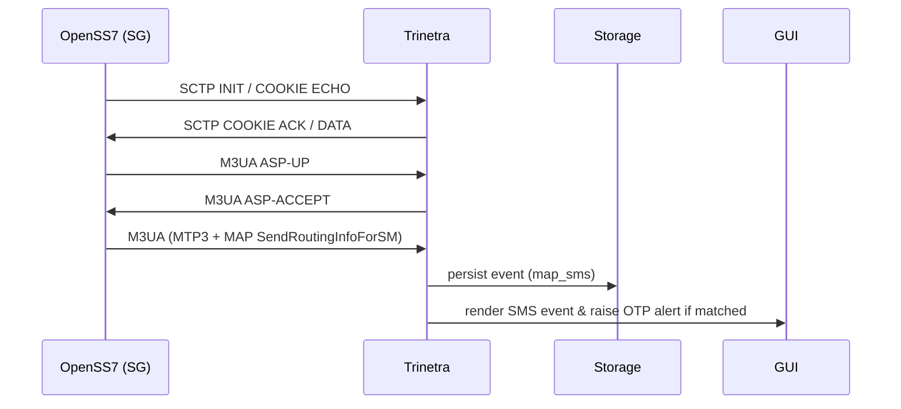

# SS7/SIGTRAN Bridge with Trinetra Integration

> **Enterprise-grade README** — now fully aligned with the Trinetra project. This document includes full installation, hardened configuration, in-depth protocol explanations, Trinetra integration details, sample configs, testing plans, security & compliance, and multiple diagrams (Mermaid + ASCII). Ready to drop into a Git repository.

---

## Table of Contents

1. Overview
2. Trinetra — Project Context & Alignment
3. Background: SS7 & SIGTRAN Essentials
4. System Requirements & Host Prep
5. Quick Install (commands)
6. Full Installation & Build (OpenSS7 + Trinetra)
7. Configuration — Deep Dive (files, parameters, examples)
8. Integration: OpenSS7 ↔ Trinetra (detailed mapping)
9. Testing & Validation (scenarios, tools, pcap examples)
10. Advanced Usage: Replay, Anomaly Injection, Scale
11. Security Hardening & Compliance Checklist
12. Logging, Auditing & Forensics
13. Troubleshooting Guide (diagnostics & fixes)
14. File & Repo Layout (samples to commit)
15. Diagrams (Mermaid + ASCII)
16. Exporting Diagrams & Automation
17. References & Useful Links
18. Legal & Ethical Disclaimer
19. Appendix: Sample Config Files

---

## 1. Overview

This README documents how to deploy a **single-node SS7/SIGTRAN bridge** (Signaling Gateway) on commodity hardware (e.g., Ryzen3 laptop) using **OpenSS7** and how to integrate it with **Trinetra** — a multi-protocol telecom interception and monitoring framework authored by Amit Kasbe.

The goal: produce a **robust lab-grade bridge** that provides M3UA (SIGTRAN) endpoints for Trinetra to consume, supports virtual SS7 links for testing, and follows defense-in-depth security, auditability and maintainability best practices.

> Intended audience: telecom engineers, security researchers, national security teams, and developers building protocol decoders. Use only with explicit authorization.

---

## 2. Trinetra — Project Context & Alignment

Trinetra is a modular, Python-based interception framework containing:

* `ss7_capture.py` — capture & pre-processing pipeline
* `engine/protocol_engine.py` — plugin loader and dispatcher
* `protocols/*` — decoders (ss7, diameter, gtp, ngap, nas5g, sip, ims, http2\_quic)
* `replay.py` — lawful replay engine
* `alerts.py`, `logger.py` — alerting & audit
* `gui.py` / REST API — operator interface

**How this README aligns with Trinetra:**

* The bridge (OpenSS7) must expose **M3UA over SCTP** and optionally raw SS7 (virtual) links. Trinetra will connect as an M3UA Application Server (AS) / Application Server Process (ASP) to receive SS7 PDUs encoded in M3UA.
* Configuration keys (`sg_ip`, `sg_port`, `routing_context`, `enabled_protocols`) are provided in the sample `config.json` (see Appendix).

---

## 3. Background: SS7 & SIGTRAN Essentials (concise)

* **SS7 layers:** MTP1 (physical), MTP2, MTP3 (routing), SCCP (subsystem routing), ISUP (call control), MAP (mobile application part) and others.
* **SIGTRAN:** transports SS7 over IP using SCTP. M3UA maps MTP3+ into IP-based messages and requires `routing_context`, `ASP/AS` states and point-code configuration.
* **SCTP:** multi-homing, multi-stream transport; packets appear in Wireshark as `sctp` then `m3ua`.

Understanding these core concepts is necessary before integrating OpenSS7 and Trinetra.

---

## 4. System Requirements & Host Prep

Minimum:

* CPU: Ryzen3 / Intel i3
* RAM: 4GB (8GB recommended)
* Disk: 50GB free (SSD recommended)
* OS: Ubuntu 22.04 LTS / Debian stable (kernel with SCTP support)

Recommended:

* Dedicated NIC, wired Ethernet
* Latest `linux-image-generic` kernel with `CONFIG_SCTP=y`

Initial prep commands:

```bash
sudo apt update && sudo apt upgrade -y
sudo apt install -y build-essential git autoconf automake libtool pkg-config \
  linux-headers-$(uname -r) libpcap-dev libsctp-dev python3 python3-venv python3-pip \
  tcpdump wireshark nmap sngrep jq
sudo modprobe sctp
```

Verify SCTP:

```bash
grep SCTP /boot/config-$(uname -r) || echo "Check kernel SCTP support"
lsmod | grep sctp || sudo modprobe sctp
```

---

## 5. Quick Install (Commands)

Use this to bootstrap quickly in a trusted lab:

```bash
# System & deps
sudo apt update && sudo apt upgrade -y
sudo apt install -y build-essential git libsctp-dev libpcap-dev python3-venv
sudo modprobe sctp

# OpenSS7
git clone https://github.com/openss7/openss7.git /opt/openss7
cd /opt/openss7
./configure --enable-autotest --enable-silent-rules
make -j$(nproc)
sudo make install

# Trinetra
git clone https://github.com/Lucifer-0217/Trinetra.git /opt/trinetra
cd /opt/trinetra
python3 -m venv venv
source venv/bin/activate
pip install -r requirements.txt

# Run example (adjust IP/interface as needed)
sudo python3 cli.py --interface eth0 --enable-alerts --output-format json
```

---

## 6. Full Installation & Build (OpenSS7 + Trinetra)

**OpenSS7**

* Build prerequisites: `autoconf`, `automake`, `libtool`, `pkg-config`.
* Configure with autotools; enable test harness.

**Trinetra**

* Create virtualenv, install dependencies from `requirements.txt`.
* Ensure `capabilities` or root context for packet capture (e.g., `setcap cap_net_raw,cap_net_admin+ep $(which python3)` or run under sudo for CLI).

Run-time expectations:

* OpenSS7 will register M3UA routes and listen on configured SCTP port (typically 2905).
* Trinetra's `ss7_capture.py` or `cli.py` will open an SCTP socket (or regular socket + pcap) to the SG and decode incoming M3UA/SS7 PDUs.

---

## 7. Configuration — Deep Dive (files & examples)

### Key config files in repo (recommended)

```
/config/openss7/ss7.cfg
/config/openss7/sigtran.cfg
/config/trinetra/config.json
```

### Example: `/config/openss7/ss7.cfg`

```ini
[point_codes]
opc = 0x010000  ; local OPC (example) — use decimal/hex depending on tool
dpc = 0x020000  ; remote DPC
ni  = 2          ; network indicator (national)

[linksets]
# virtual linkset for lab
lab_links = {
  type = virtual
  links = [ "vlink0" ]
}
```

**Parameter notes:**

* **opc/dpc**: choose values outside production ranges in lab. Keep documentation of point-codes used.
* **ni**: 0–3 (0 = international? check implementation docs).

---

### Example: `/config/openss7/sigtran.cfg`

```ini
[general]
local_ip = 192.168.100.10
local_port = 2905
remote_ip = 192.168.100.20
remote_port = 2905
routing_context = 1001
asp_id = 2001

[m3ua]
asp_name = TRINETRA_ASP
as_name = TRINETRA_AS

[logging]
level = INFO
logfile = /var/log/openss7/openss7.log
```

**Important:** `routing_context` and `asp_id` must match Trinetra's config.

---

### Example: `/config/trinetra/config.json`

```json
{
  "interface": "eth0",
  "sg_ip": "192.168.100.10",
  "sg_port": 2905,
  "routing_context": 1001,
  "enabled_protocols": ["ss7","diameter","sip","nas5g","ims","gtp"],
  "alerts": {
    "enabled": true,
    "keywords": ["OTP","password","pin"],
    "telegram": {"token":"REDACTED","chat_id":"REDACTED"}
  },
  "output_format": "json",
  "logging": {"level":"INFO","path":"/var/log/trinetra/trinetra.log"}
}
```

**Security note:** Never commit real tokens/keys. Use environment variables or secret store when deploying.

---

## 8. Integration: OpenSS7 ↔ Trinetra (Detailed Mapping)

This section maps OpenSS7 runtime concepts to Trinetra expectations.

| OpenSS7                 | Meaning                       | Trinetra mapping                                         |
| ----------------------- | ----------------------------- | -------------------------------------------------------- |
| local\_ip / local\_port | SG IP/port for SCTP           | `config.json.sg_ip` / `sg_port`                          |
| routing\_context        | M3UA routing context          | `config.json.routing_context`                            |
| asp\_id                 | Application Server Process ID | used to identify ASP in Trinetra's session management    |
| opc/dpc                 | Point codes for routing       | used by Trinetra to tag messages with origin/destination |

**Session lifecycle:**

1. SCTP association up (SCTP INIT/COOKIE exchange)
2. M3UA ASP UP / ASP ACTIVE
3. M3UA data messages containing SS7 payloads (MTP3/MAP/ISUP)
4. Trinetra decodes PDUs, persists events, raises alerts

**Operational checks:**

* Ensure SCTP association remains stable — watch `ss` / `netstat -s` for retransmits.
* If Trinetra loses association, ensure `sigtran.cfg.remote_ip` points to Trinetra's host and firewall allows SCTP.

---

## 9. Testing & Validation (scenarios & commands)

### Tools used

* `tcpdump`, `tshark`, `wireshark` — capture & dissect M3UA/MAP/ISUP PDUs
* `ss7test`, `mtptool` — OpenSS7 test utilities
* Trinetra unit tests / `tests/` pcaps in repo

### Example captures

```bash
# capture SCTP M3UA traffic on port 2905
sudo tcpdump -i eth0 port 2905 -w /tmp/sigtran_2905.pcap

# open in Wireshark and filter: m3ua || sccp || map || isup
```

### Test scenarios

1. **M3UA Bring-up** — verify SCTP assoc + ASP states
2. **MAP SMS Flow** — inject test MAP-SEND\_ROUTING\_INFO/SM-RP and confirm Trinetra decodes IMSI / MSISDN
3. **ISUP Call Flow** — IAM → ACM → ANM → REL
4. **Anomaly & Replay** — use `replay.py` to send previously captured PDUs (authorized only)
5. **Stress Test** — generate an INVITE flood or high-rate MAP to validate system limits and alerting

**Sample commands** (OpenSS7 test harness syntax depends on build):

```bash
# hypothetical
/opt/openss7/bin/ss7test --m3ua-bringup --local 192.168.100.10 --remote 192.168.100.20 --port 2905
/opt/openss7/bin/mtptool --send-map --imsi 123456789012345 --msisdn 919876543210
```

---

## 10. Advanced Usage: Replay, Anomaly Injection, Scale

### Replay (`replay.py`)

* Enforced with `security.py` checks: only authorized user IDs and signed replay manifests allowed.
* Every replay must create a reversible audit trail and be time-limited.

### Anomaly injection

* Use test harness to create invalid MTP3 sequences, malformed SCCP headers, unexpected MAP opcodes.
* Trinetra's `alerts.py` should flag these.

### Scale

* For larger labs, deploy OpenSS7 as containerized services on multiple hosts. Use load balancers for M3UA endpoints (L4) and STP-like routing logic to distribute traffic.
* Centralize Trinetra collectors to a message queue (Kafka) for horizontal decoder workers.

---

## 11. Security Hardening & Compliance Checklist

1. **Network**

   * Isolate lab VLAN
   * Restrict SCTP/TCP ports to authorized hosts only
2. **Host**

   * Harden kernel: disable unused netfilter modules
   * Keep system patched
3. **Process**

   * Run services as non-root users where possible
   * Use `setcap` to grant raw socket capabilities to Python binary if avoiding root
4. **Secrets**

   * Use env vars or vault for tokens
5. **Logging**

   * Immutable audit logs (append-only), signed daily
6. **Legal**

   * Maintain explicit authorizations (signed), duration, and scope

Checklist artifact: `/docs/compliance_checklist.md`

---

## 12. Logging, Auditing & Forensics

Trinetra and OpenSS7 logs should be aggregated to a central system (ELK, Graylog):

* `trinetra.log` — human readable
* `trinetra.json` — structured events
* `trinetra.db` — SQLite for GUI queries
* `openss7.log` — stack logs

Ensure time sync (`chrony`/`ntp`) and apply digital signatures to daily log bundles (`gpg --detach-sign`) to provide tamper-evidence.

---

## 13. Troubleshooting Guide (Diagnostics & Fixes)

**SCTP assoc fails**

* `ss -s` to view SCTP stats
* `sudo tcpdump -i eth0 sctp and port 2905` to capture INIT/COOKIE exchanges
* Check firewall / iptables / ufw rules

**OpenSS7 build failures**

* Missing autotools: `sudo apt install autoconf automake libtool pkg-config`
* Ensure you have kernel headers matching running kernel

**Trinetra decoder no output**

* Confirm `config.json.enabled_protocols` includes `ss7`
* Check mapping of `routing_context` and `opc/dpc` in captures

**High CPU**

* Reduce `enabled_protocols` and apply sampling on heavy protocols (e.g., GTP-U)

---

## 14. File & Repo Layout (Recommended)

```
Trinetra-Bridge-Repo/
├── README.md  # this file
├── LICENSE
├── config/
│   ├── openss7/ss7.cfg
│   ├── openss7/sigtran.cfg
│   └── trinetra/config.json
├── diagrams/
│   ├── architecture.mmd
│   └── seq_map_sms.mmd
├── scripts/
│   ├── start_openss7.sh
│   ├── start_trinetra.sh
│   └── export_diagrams.sh
├── tests/
│   ├── pcaps/
│   └── unit/
└── docs/
    └── compliance_checklist.md
```

Include a `LICENSE` (Python License header suggested by Trinetra), and make sure `config/` contains sample, sanitized configs only.

---

## 15. Diagrams (Mermaid + ASCII)

### Architecture (mermaid)

```mermaid
flowchart LR
  subgraph LAB
    SG[OpenSS7 - SG (M3UA over SCTP)] -->|M3UA (SCTP 2905)| TR[Trinetra Collector]
    TR --> DB[(DB - trinetra.db & PCAP Storage)]
    TR --> GUI[Trinetra GUI / REST API]
  end
  subgraph ADMIN
    OP[Operator Workstation] -->|HTTPS/SSH| GUI
  end
```

### Sequence: MAP SMS flow



### ASCII Topology

```
+---------------------------+        +-------------------------+
|  Ryzen3 Laptop (Host)     |        |  Admin Workstation      |
|  - OpenSS7 (SG)           | <----> |  - GUI (HTTPS)         |
|  - /etc/openss7/*         |  SCTP  |  - Operator            |
+---------------------------+ 2905   +-------------------------+
           |
           v
   +-----------------------+
   |  Trinetra Collector   |
   |  - Decoders           |
   |  - Alerts & DB        |
   +-----------------------+
```

---

## 16. Exporting Diagrams & Automation

Use Mermaid CLI or Docker images to export `.mmd` files to PNG/SVG. Example script included in `scripts/export_diagrams.sh`:

```bash
#!/usr/bin/env bash
set -e
mkdir -p diagrams/export
npx @mermaid-js/mermaid-cli -i diagrams/architecture.mmd -o diagrams/export/architecture.png
npx @mermaid-js/mermaid-cli -i diagrams/seq_map_sms.mmd -o diagrams/export/seq_map_sms.png
```

If Node is not available, use Docker-based mermaid-cli container.

---

## 17. References & Useful Links

* OpenSS7 GitHub: [https://github.com/openss7/openss7](https://github.com/openss7/openss7)
* OpenSS7 manuals and STREAMS docs
* RFCs: M3UA (RFC 4666), SIGTRAN family
* Wireshark dissector docs for M3UA/SCCP/MAP/ISUP
* Trinetra repository and protocol docs (internal)

---

## 18. Legal & Ethical Disclaimer

This repository and the tools described are strictly for **authorized**, **lawful**, and **ethical** use. Unauthorized interception or tampering with live telecom infrastructure is illegal in most jurisdictions. Before using any of these tools outside of an isolated lab, obtain explicit, written authorization from the operator and legal counsel.

---

## 19. Appendix: Sample Config Files

The following example configs are sanitized and intended only for lab use.

### `config/openss7/ss7.cfg` (sanitized)

```ini
[point_codes]
opc = 1
dpc = 2
ni  = 2

[linksets]
lab = { type = virtual; links = ["vlink0"] }
```

### `config/openss7/sigtran.cfg`

```ini
[general]
local_ip = 192.168.100.10
local_port = 2905
remote_ip = 192.168.100.20
remote_port = 2905
routing_context = 1001
asp_id = 2001

[logging]
level = INFO
logfile = /var/log/openss7/openss7.log
```

### `config/trinetra/config.json`

```json
{
  "interface": "eth0",
  "sg_ip": "192.168.100.10",
  "sg_port": 2905,
  "routing_context": 1001,
  "enabled_protocols": ["ss7","diameter","sip","nas5g","ims","gtp"],
  "alerts": {"enabled": true, "keywords": ["OTP","password"]},
  "output_format": "json",
  "logging": {"level":"INFO","path":"/var/log/trinetra/trinetra.log"}
}
```

---

### Final notes

* The README has been expanded to include **Trinetra-specific operational mappings** and a stronger set of **security, testing and compliance** guidance.
* Next steps I can take for you (I can do one or more):

  1. **Generate sanitized sample files** for the repo (`config/`, `scripts/`, `diagrams/`) and commit-ready content.
  2. **Export the Mermaid diagrams** to PNGs and attach them to the repo.
  3. **Create a one-page PPT** for your Maharashtra meeting summarizing architecture, legal controls and PoC steps.
  4. **Produce an infrastructure-as-code script** (Ansible playbook / Docker compose) to bootstrap the lab.

Tell me which of the above you want next and I’ll proceed — I already prepared the README update and saved it in the canvas.
